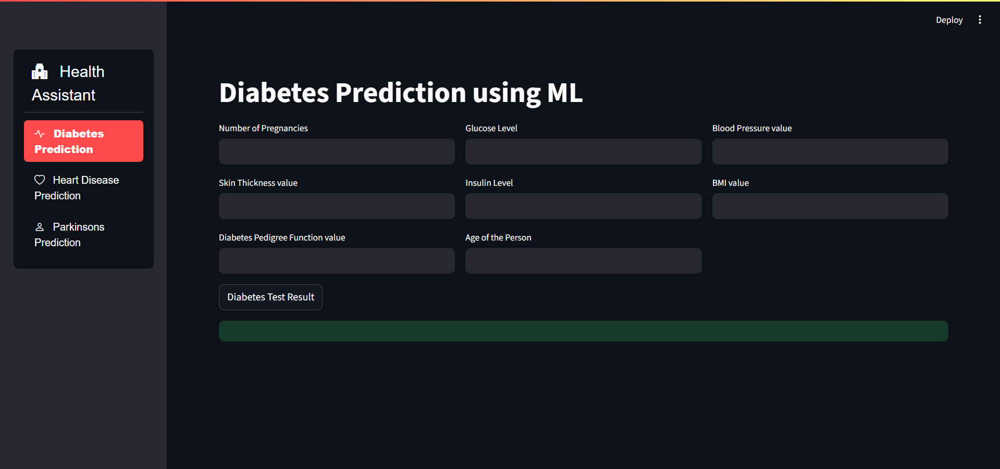

# Disease Prediction Web App

A Streamlit-based web application that predicts the likelihood of **Diabetes**, **Heart Disease**, and **Parkinson's Disease** using pre-trained machine learning models.

---

## Features

- **Easy-to-use web interface** with sidebar navigation
- **Three disease prediction modules**: Diabetes, Heart Disease, Parkinson's Disease
- **Instant results** based on user input
- **Train and Load** the model as `.sav` files

---

## Demo

 <!-- Add a screenshot if available -->

---

## Requirements

- Python 3.8+
- [Streamlit](https://streamlit.io/)
- [streamlit-option-menu](https://github.com/victoryhb/streamlit-option-menu)
- scikit-learn
- pickle

---

## Installation

1. **Clone the repository**
   ```bash
   git clone <repo-url>
   cd "Disease Prediction"
   ```

2. **Install dependencies**
   ```bash
   pip install -r requirements.txt
   ```
   Or manually:
   ```bash
   pip install streamlit streamlit-option-menu scikit-learn
   ```

3. **Ensure model files are present**
   - `models/diabetes_model.sav`
   - `models/heart_model.sav`
   - `models/parkinsons_model.sav`

---

## Usage

1. **Activate your Python environment** (if using conda/venv)
   ```bash
   conda activate <your-env>
   ```

2. **Run the Streamlit app**
   ```bash
   streamlit run main.py
   ```

3. **Open the app in your browser** (usually at [http://localhost:8501](http://localhost:8501))

4. **Select a disease from the sidebar**, enter the required values, and click the prediction button to see results.

---

## File Structure

```
Multiple Disease Prediction/
├── main.py
|   data
|   files
├── models/
│   ├── diabetes_model.sav
│   ├── heart_model.sav
│   └── parkinsons_model.sav
├── requirements.txt
└── README.md
```

---

## License

This project is for educational purposes only.